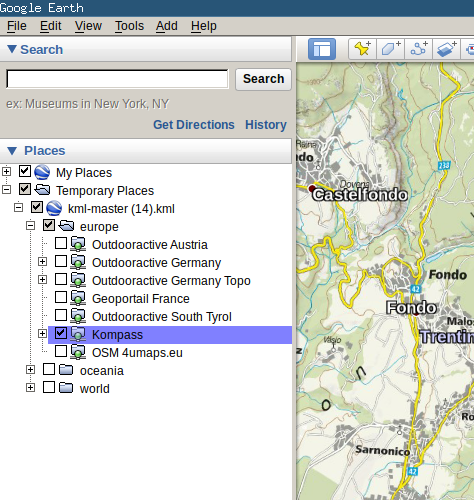

# Google Earth Overlay Server (GEOS)

This is a python-based server for creating Google Earth overlays
of tiled maps. Your can now also display maps in the web browser,
measure distances and print maps as high-quality PDF's.

Developers can also use *GEOS* as a library to convert coordinates
or to access the map printing functionality programmatically.

## **NEW**: [geos-web](http://geos.gsturm.eu/)
Use GEOS on the web without installation on [geos.gsturm.eu](http://geos.gsturm.eu/).
Note that for legal reasons, the public version comes with a very limited set of maps.
You still can [install and use](https://geos.readthedocs.io/en/latest/) GEOS locally with full flexibility!

## Documentation is available at [https://geos.readthedocs.io/en/latest/](https://grst.github.io/geos)
* [Installation](https://geos.readthedocs.io/en/latest/users.html#installation)
* [Usage](https://geos.readthedocs.io/en/latest/users.html#usage)
* [Adding and Creating Maps](https://geos.readthedocs.io/en/latest/users.html#more-maps)
* [Developer's Guide](https://geos.readthedocs.io/en/latest/developers.html)

## Aspirations
Can GEOS become a unified interface for converting, displaying and using web maps?
Like a web-based version of the seemingly old-fashioned [MOBAC](http://mobac.sourceforge.net)?

Imagine you can draw and measure on a map like in [Swisstopo](https://map.geo.admin.ch), download paper maps
as simple as with [nkart.no](http://www.nkart.no/) and create an offline map for your GPS device just as
with [MOBAC](http://mobac.sourceforge.net) for any map out there simply in your web browser.

## Contributing
If that sounds as awesome to you as it does to me, feel free to fork and create
pull requests or simply drop me a message.

## Alternatives
If you want to setup `geos` on a server, you might as well consider [MapProxy](https://mapproxy.org), which is much more professional but a bit more challenging to configure.

